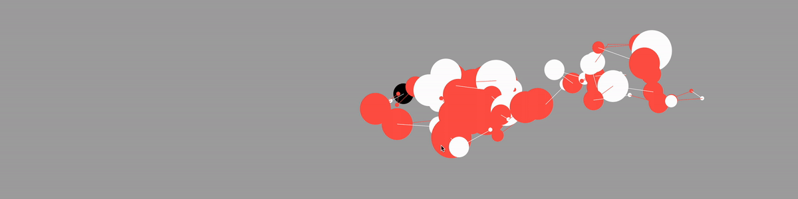

# Where am I

I aimed to capture my emotions and experiences while walking the streets of New York City in this artwork. It was a place where I could sense various sounds, smells, and people as I roamed through the crowded streets, sandwiched between towering buildings. I wanted to convey my journey of encountering the unpredictable landscapes, people, and a variety of sensations, including different tobacco and garbage smells, as everything approached me with a fresh perspective.

The patterns in the artwork consist of repeating lines and shapes, with non-linear movements and directions, symbolizing the traces of my experience in New York. They represent my journey of experiencing the city in various ways, both big and small.

##### Generating progress

##### Where am I 01

##### Where am I 02

