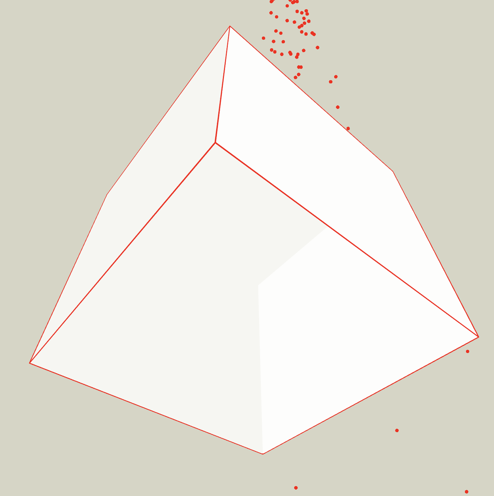
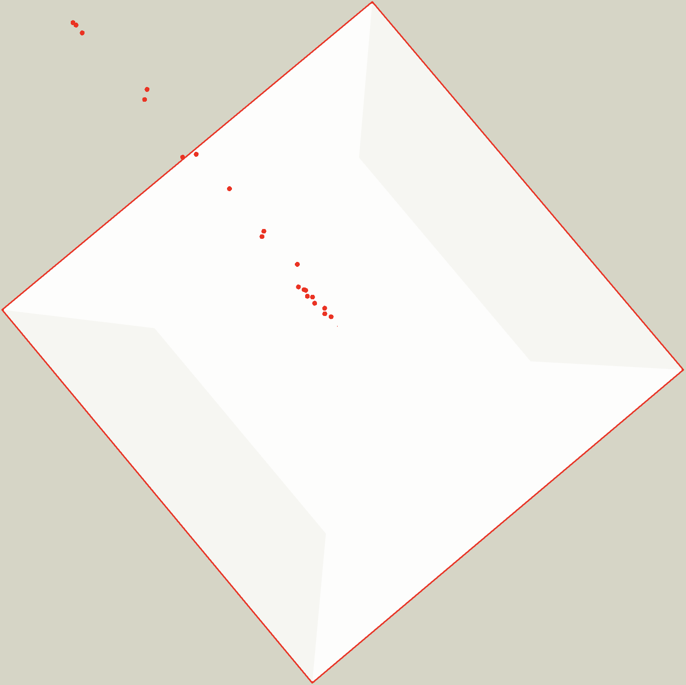
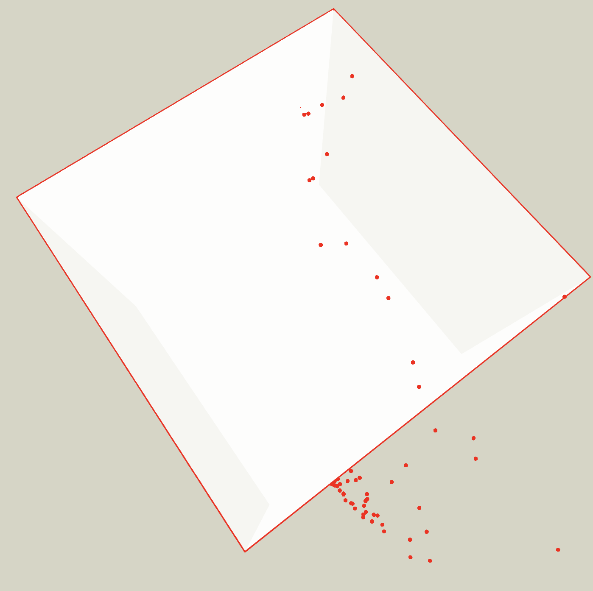

# Trapped in time, Pursuing time

Everything on Earth flows based on the logic of 'time,' even though we may not fully understand what 'real time' represents. It's possible that the concept of time, as we perceive it, may not even exist on Earth.

Since we are unable to grasp the true dimension of time, we simply quantify it in hours, minutes, and seconds, and everyone follows this relentless flow with each passing moment. It's challenging to deny the relentless march of time.

Time, unlike space, doesn't communicate directly. Time's essence is intricately linked to the concept of space, and the nature of space and dimension may evolve, but often, we remain oblivious to such changes. We merely abide by time's flow.

In this context, the box represents space, while the dots symbolize our lives. Even though time may have other dimensions, our comprehension is confined to a two-dimensional and linear timeline.

This artwork illustrates how we are tirelessly pursuing time, and this pursuit is what real time might be all about.

##### Trapped in time, Pursuing time 1

##### /rapped in time, Pursuing time 2

##### Trapped in time, Pursuing time 3
