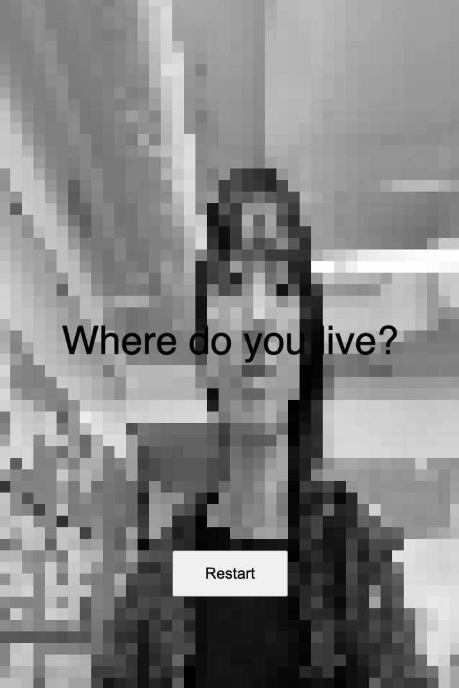
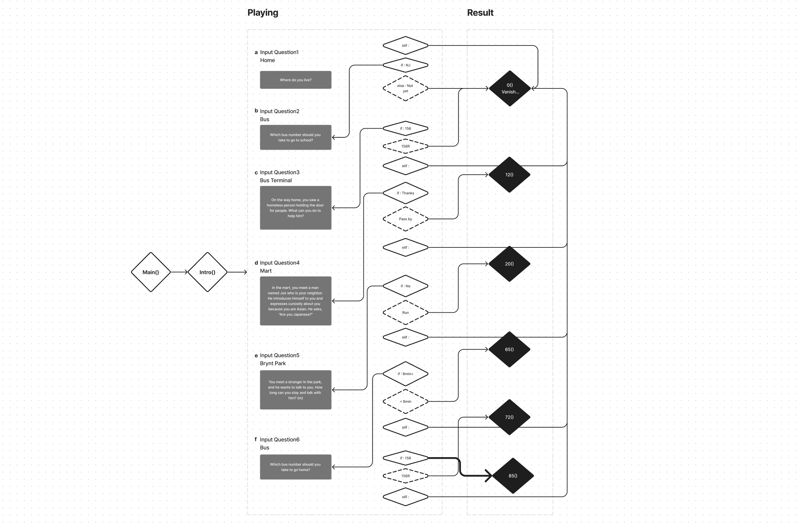

# WIP | Shadow Keeper

## Introduction

Based on the experiences I had when I first arrived in New York, I created a game where my choices and responses make people perceive my existence in a city where I know no one. In this way, my presence is formed and sometimes disappears. I wanted to create a game based on these experiences.

I wanted to create a one-button game using the Shadow Keeper concept that we worked on for Week 3 assignment.

## Shadow Keeper

The Shadow represents 'existence.' The game involves the player answering questions to protect the Shadow. In the background, the player is shown, represented by their shadow. Questions appear on top of the shadow. By pressing buttons, the player makes choices and provides answers. Depending on the chosen answers, the game's logic determines how well the player's Shadow is protected, which is revealed as the game's outcome.

There is no clear-cut answer. Through this, I aimed to reflect the reality of not knowing what consequences my actions to protect my existence will bring.

## Game Flow chart

It is consist of 6 questions and 6 results.
