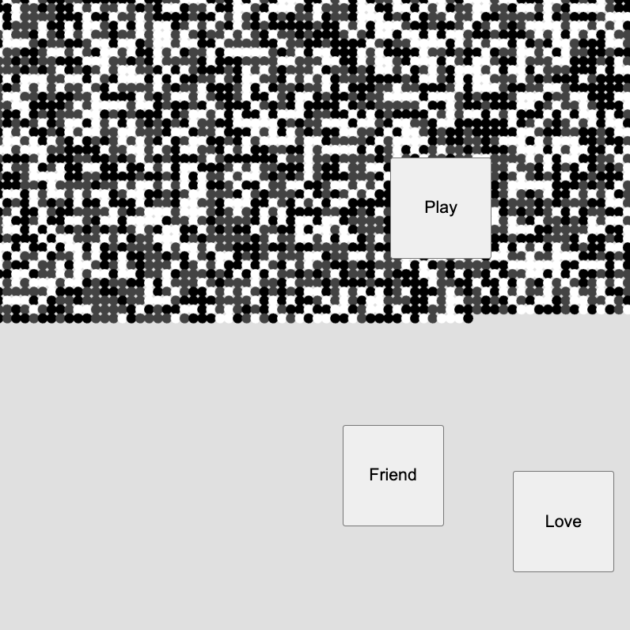

# Play, Love, Friend

I believe that play, love, and friendships ultimately add color to life, allowing organisms to thrive. Small dots come together to form lines, and lines come together to form shapes. Organisms continue to grow and be fulfilled. As you press the buttons, the artwork of life can take on color, symbolizing the attention and care given.

